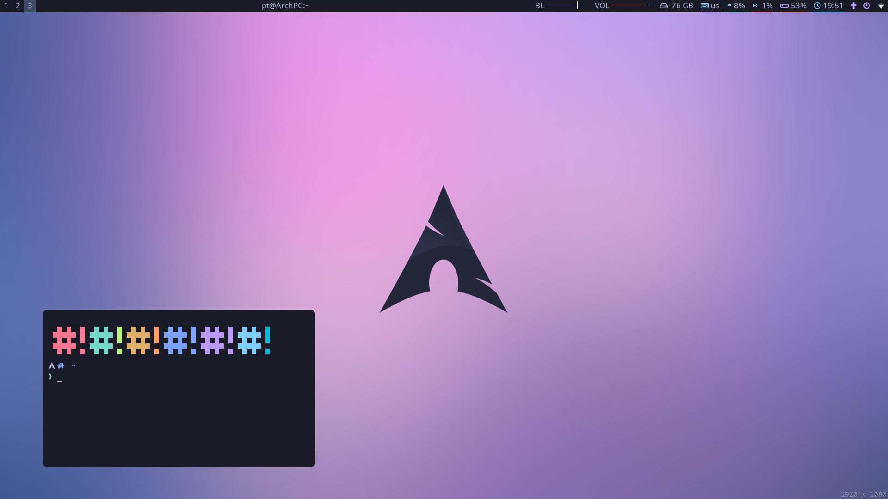
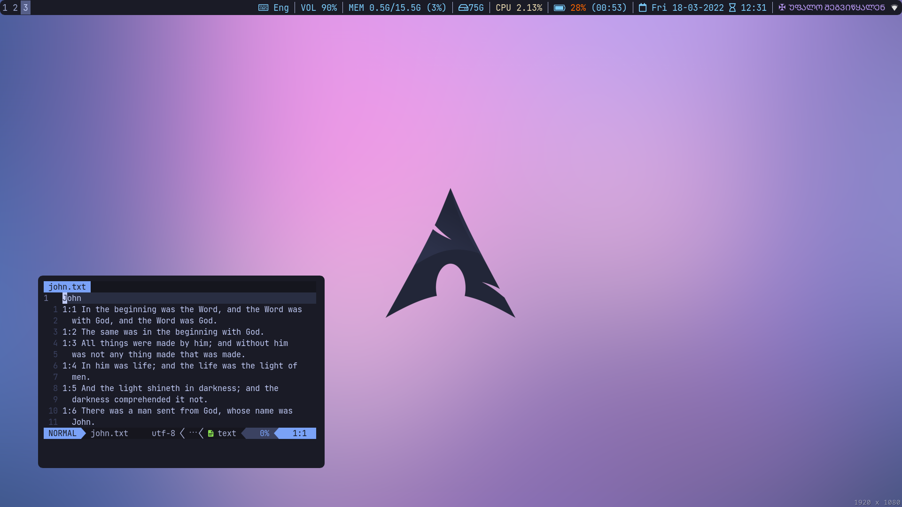

# My i3 Configuration

This is the configuration file for my i3 window manager.

## Screenshots

### With i3blocks

## Dependencies

There are several applications that you should have installed in order for this
configuration to work.

### Essentials:

- i3-gaps (duh)
- [My i3blocks](https://github.com/CondensedMilk7/i3blocks)
  or [my Polybar](https://github.com/CondensedMilk7/polybar)
- compton or picom (I use [picom-ibhagwan](https://aur.archlinux.org/packages/picom-ibhagwan-git))
- [Tokyo Night GTK theme](https://www.gnome-look.org/p/1681315/)
- [my neovim config](https://github.com/CondensedMilk7/nvim)

### Default Applications and Utilities (optional, can be substituted):

- light (for adjusting screen brightness)
- rofi (run menu, can be substituted with dmenu)
- alacritty (my terminal emulator of choice)
- brave (browser)
- visual studio code
- thunar (file manager)
- xfce4-screenshooter (screenshot app)
- [i3lock-color](https://github.com/Raymo111/i3lock-color)
  for custom lock script in the scripts folder

### Fonts

- JetBrains Mono (for all around text)
- Font Awesome (for icons)
- Noto Sans (optional, if you want my custom prompt on the i3blocks bar)
- Polybar font dependencies (see polybar documentation)

## Features

This is basically a regular i3-gaps configuration with few custom applications.
Therefore it can be easily reconfigured and built upon. The keybindings for window
manipulation are vanilla, with the exception of modkey being super instead of alt,
direction keys changed to h j k l, horizontal split changed to $mod+m.

Use mod+ctrl+l to lock screen.

The colorscheme for this rice is based on one and only: Tokyo Night. The colors are
defined as variables so they are easy to change as long as they follow a similar pattern.

The same goes for default applications you are free to change their values to your
preferred apps.

Refer to my [i3-blocks configuration](https://github.com/CondensedMilk7/i3blocks)
or my [polybar configuration](https://github.com/CondensedMilk7/polybar)
to see a matching statusbar.
Here's my [picom config](https://gist.github.com/CondensedMilk7/04f642785b17502900bc5bb2c6c29708) for round corners.
The rest is plain old
i3 about which you can learn more from the
[official documentation](https://i3wm.org/docs/)
